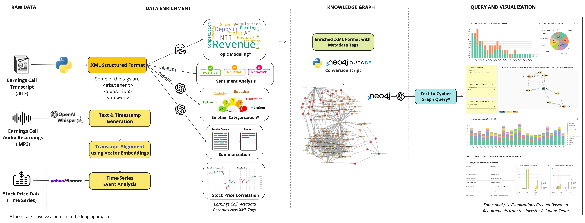
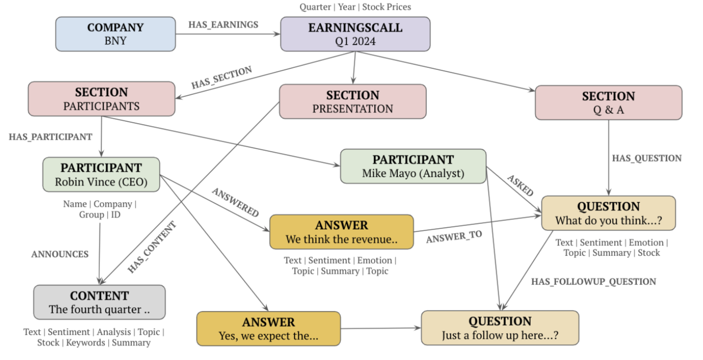
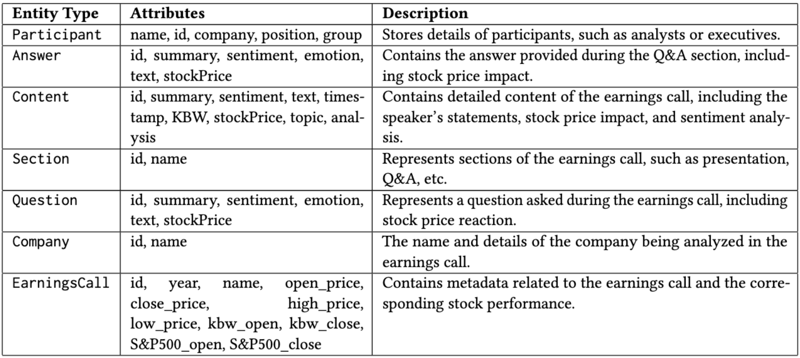
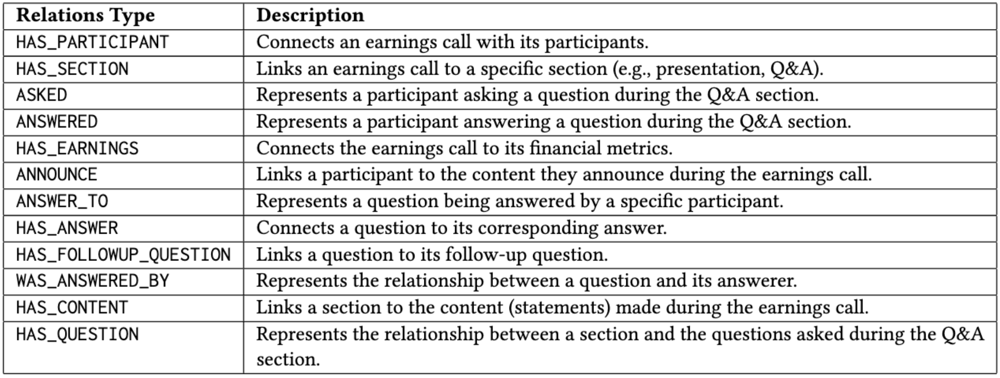
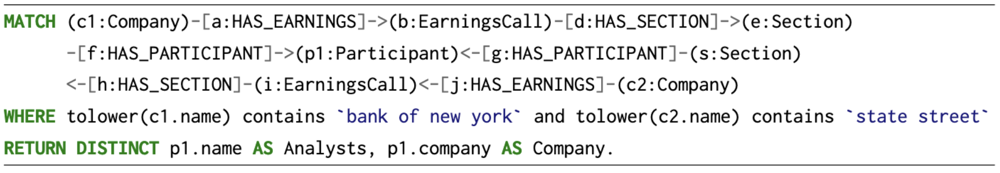
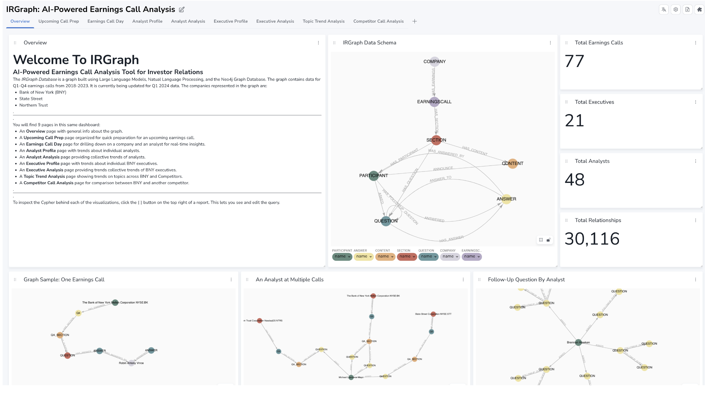
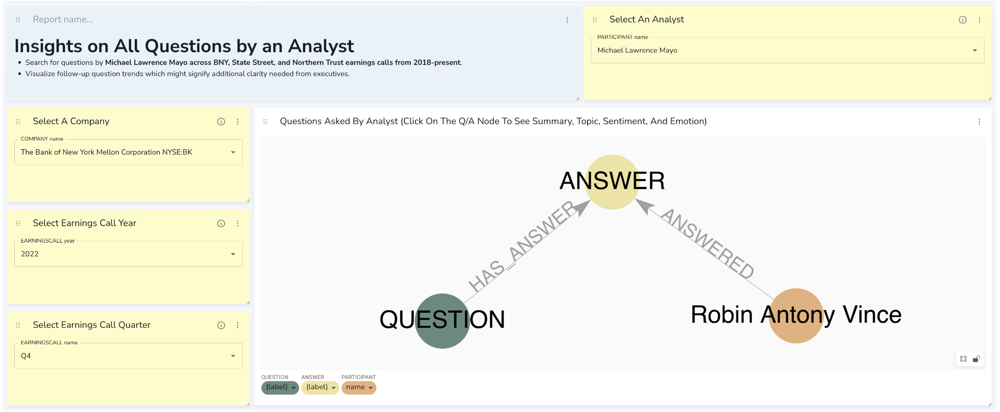
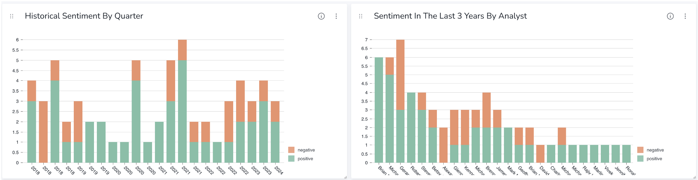

# IRGraph: Leveraging NLP, LLMs, and Knowledge Graphs for Investor Relations


Earnings calls are critical events where analysts ask executives questions in an unscripted Q&A session, revealing real-time sentiment that shapes stock ratings and investor behavior. The unstructured nature and large quantity of these transcripts complicates analysis, often leading to missed context. 

Our framework, IRGraph leverages NLP, LLMs, and Knowledge Graphs to connect questions, answers, and relationships between companies, participants, and stock trends, automating transcript analysis to enhance insights and communication strategies for Investor Relations teams.

Our contributions include:
1. **Data Enrichment**: Generate metadata to annotate transcripts.
2. **Speaker-Stock Correlation**: Link transcript text to stock price changes.
3. **Knowledge Graph Schema**: Organized data in Neo4j captures companies, participants, and relationships.
4. **Text-to-Cypher Querying**: LLMs translate questions into Cypher queries for efficient data retrieval, with a human-in-the-loop process.
5. **Visualization Dashboard**: NeoDash dashboards reveal insights with interactive charts.

This project commenced as a collaborative effort between Bank of New York (BNY) and Carnegie Mellon University (CMU), supported by a dedicated team of students, faculty, and practitioners. We express our gratitude to the faculty and students from the Master’s of Artificial Intelligence and Innovation program.

This project started with the name "BKGraph" representing the BNY stock ticker, BK, and KG representing knowledge graphs. We have broadened the scope to be "IRGraph" to represent Investor Relations. Please check our [Confluence page](https://nyu-tmi-capstone.atlassian.net/wiki/spaces/SD/overview) for more information.

## Data Collection and Tool Integration

IRGraph constructs a comprehensive knowledge graph by integrating diverse data sources, for BNY, Northern Trust, and State Street, covering 2018 to Q1 2024.

1. **Earnings Call Transcripts:** These are sourced from Capital IQ in rich-text format (.RTF), providing a textual record of all spoken content during earnings calls.
2. **Earnings Call Audio Recordings:** Acquired from Capital IQ, these .MP3 files provide speech content and allow for the alignment of spoken words with financial data.
3. **Stock Price Data:** Stock prices are retrieved from Yahoo Finance's API, allowing us to correlate stock movements with specific moments in the call. We also include the stock's daily opening, closing, high, and low prices, along with the KBW Bank Index and S&P 500 Index opening and closing values for the earnings call day.
4. **Audio-Derived Transcripts:** The earnings call audio recordings are transcribed using the OpenAI Whisper model to produce text segments with corresponding timestamps. Stock prices are correlated based on the timestamps to match specific moments in the call, providing deeper insights into market reactions.

We structure the transcripts into XML format, then enrich the XML with metadata tags that capture **sentiment, emotion, summaries, topics, and stock price movements**. 

## Knowledge Graph Construction
Our base graph spans Bank of New York (BNY), State Street, and Northern Trust, covering 21 executives and 48 analysts from 77 quarterly transcripts (Q1 2018 - Q1 2024), resulting in 5,014 nodes and 30,116 relationships.





## Knowlege Graph Querying
We use LLMs to generate Cypher queries from natural language questions. However, we recognize that these generated queries can occasionally be incorrect or inefficient. When an LLM-generated query does not perform as
expected, we manually adjust the query to improve its accuracy or efficiency. This human intervention plays a critical role in refining the process. 

Below is the domain-specific Cypher query for this question: 
> “Which analysts participated in earnings calls for BNY and State Street?”



## Dashboard for Investor Relations Insights
Our dashboard, built with NeoDash by Neo4j, supports interactive visualization with graphs, charts, tables, and more. The dashboard pages are Overview, Upcoming Call Prep, Earnings Call Day, Analyst Profile & Analysis, Executive Profile & Analysis, Topic Trend Analysis, Competitor Call Analysis.

Here are some examples of insights offered on the dashboard:





## Future Directions
Our framework, while focused on Investor Relations, has applications across Communications and Marketing. Future directions including agent-based modeling for predictive analysis, vector search for enriched pre-call data, real-time sentiment tracking during live earnings calls, nonverbal analysis, and text-to-chart visualization could enhance user flexibility and insight depth.

## Set-Up Instructions
### 1. Create the Neo4j Database

1. Go to [Neo4j Aura](https://neo4j.com/aura/) to create an account and log in.
2. Click the "New Instance" button on the page. Or if this is the first time you are using Neo4j, you should be directed to the page to create your first instance. **Remember to save your password somewhere!!**
3. It takes a few minutes to create the instance.
4. Copy the connection URI which starts with `neo4j+s://` for further usage.
5. You can click "Open" and enter the password you copied down before to connect to the instance.
6. Start using the Neo4j database.

### 2. Run Our GitHub Repo

1. Clone the repo: `https://github.com/CMU-MSAII-BNY-AIHUB/IRGraph.git`

2. In the root directory `IRGraph`, run the following command to set up the environment:

   ```bash
   pip install -r requirements.txt
   ```

3. Follow the `config.ini.sample` to create your `config.ini` file, and put your instance URI and password in this file in the following format:

   ```ini
   [NEO4J]
   uri = <your neo4j instance uri>
   password = <your neo4j instance password>
   ```

4. Go to the `pipeline` folder. This is the folder where we run our upstream pipeline to create the knowledge graph database.

5. For a simple run, download and unzip `pipeline/xml.rar`, and put them in a folder called `xml`:

   ```
   IRGRAPH
   └── ...
   └── requirements.txt
   └── config.ini
   └── pipeline
       └── ...
       └── upstream_pipeline.py
       └── xml
           └── BK-Q1-2018.xml
           └── ...
   ```

5. Now you can run the below command to create from the XML file we provide and build your Neo4j knowledge graph database:

   ```bash
   python upstream_pipeline.py --save-dir "xml" --generate-from-rar
   ```

---
For more runtime options, stay tuned…
