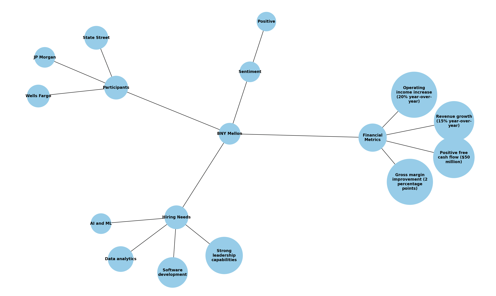

# BKGraph Voice
We have created a sample knowledge graph to answer these 4 questions:
- What are the key financial metrics discussed during the earnings call?
- What companies were represented in the participants who asked questions?
- What is the overall sentiment of investors towards BNY Mellon?
- What specific skills and talents is BNY Mellon actively seeking to hire?

Below is a visualization of the graph: 


As a feature of BKGraph, we are building out a voice interaction system for you to be able to interact with the graph using another modality in addition to text. 


Follow the setup below to complete the demo.

# Setup
## 1. Install required packages
```bash
pip3 install -r requirements.txt
brew install ffmpeg
brew install espeak
```

## 2. Setup OpenAI API Key

OpenAI Whisper is used for speech-to-text. Create a `.env` file in the project directory and add your OpenAI API key. You can get your key from here: https://platform.openai.com/api-keys

```.env
OPENAI_API_KEY=your_openai_api_key_here
```

## 3. Create the Knowledge Graph

```bash
python3 sample_knowledge_graph.py
```

## 4. Ask Questions to the BKGraph Voice System
```bash
python3 bkgraph_voice.py
```